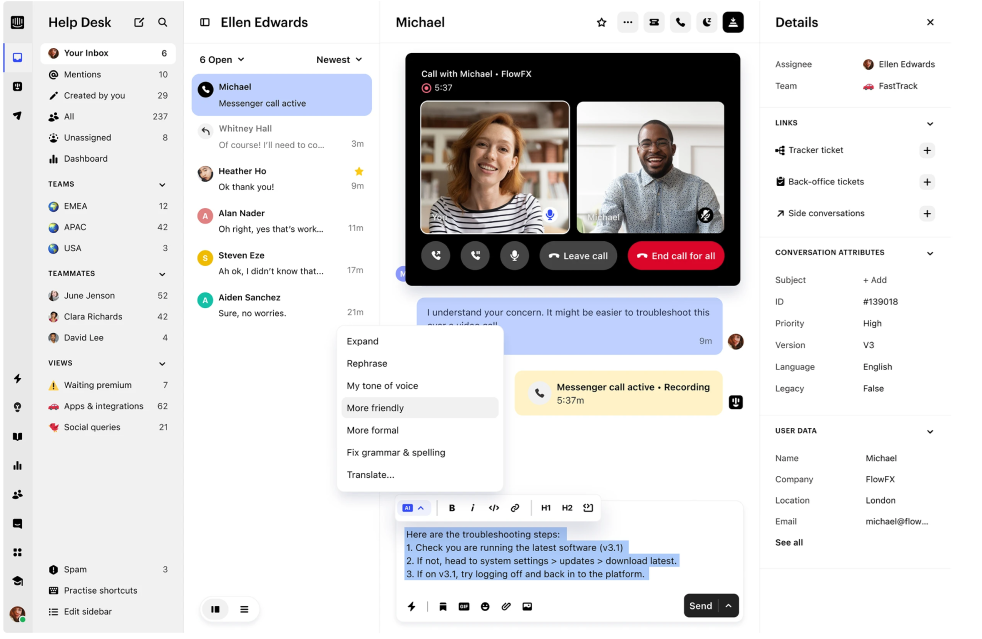

# Intercom Clone

This project is a clone of the Intercom web application, built using **Vite**, **React**, **TypeScript** and **Tailwind CSS** . It replicates the core UI and basic interaction patterns of Intercom, including sidebar navigation, inbox management, chat/messenger interface, and details panel.

## Screenshot(reference)



## Features

- **Modern UI**: Clean, responsive layout inspired by Intercom.
- **Sidebar Navigation**: Switch between inbox, teams, teammates, and views.
- **Inbox Panel**: View and select conversations.
- **Messenger/Chat**: Send and receive messages with a message input composer and action buttons.
- **Details Panel**: View user and ticket details.
- **Iconography**: Uses [React Icons](https://react-icons.github.io/react-icons/) for a professional look.
- **Component-Based**: Modular React components for easy maintenance and extension.
- **Styling**: Built with Tailwind CSS for rapid and consistent styling.
- **Fast Development**: Powered by Vite for instant hot module reloading and fast builds.

## Tech Stack

- [React](https://react.dev/)
- [TypeScript](https://www.typescriptlang.org/)
- [Tailwind CSS](https://tailwindcss.com/)
- [Vite](https://vitejs.dev/)
- [React Icons](https://react-icons.github.io/react-icons/)

## Getting Started

1. **Install dependencies:**

   ```sh
   npm install
   ```

2. **Start the development server:**

   ```sh
   npm run dev
   ```

3. **Open your browser:**
   Visit [http://localhost:5173](http://localhost:5173) to view the app.

## Project Structure

```
src/
  components/
    Navbar/         # Sidebar and top navigation
    Sidebar/        # Sidebar data and UI
    Inbox/          # Inbox, chat, and details panel
      Messenger/    # Messenger/chat UI
  App.tsx           # Main app entry
  index.css         # Global styles (includes Tailwind)
```

## Customization

- **Add new sections**: Edit `SidebarData.ts` and `NavbarData.ts`.
- **Change styling**: Modify Tailwind classes in component files or extend `tailwind.config.js`.
- **Add features**: Extend React components as needed.

## License

This project is for educational and demonstration purposes only. Not affiliated with Intercom.

---

Built with ❤️ using React, TypeScript, Tailwind CSS, and Vite.
